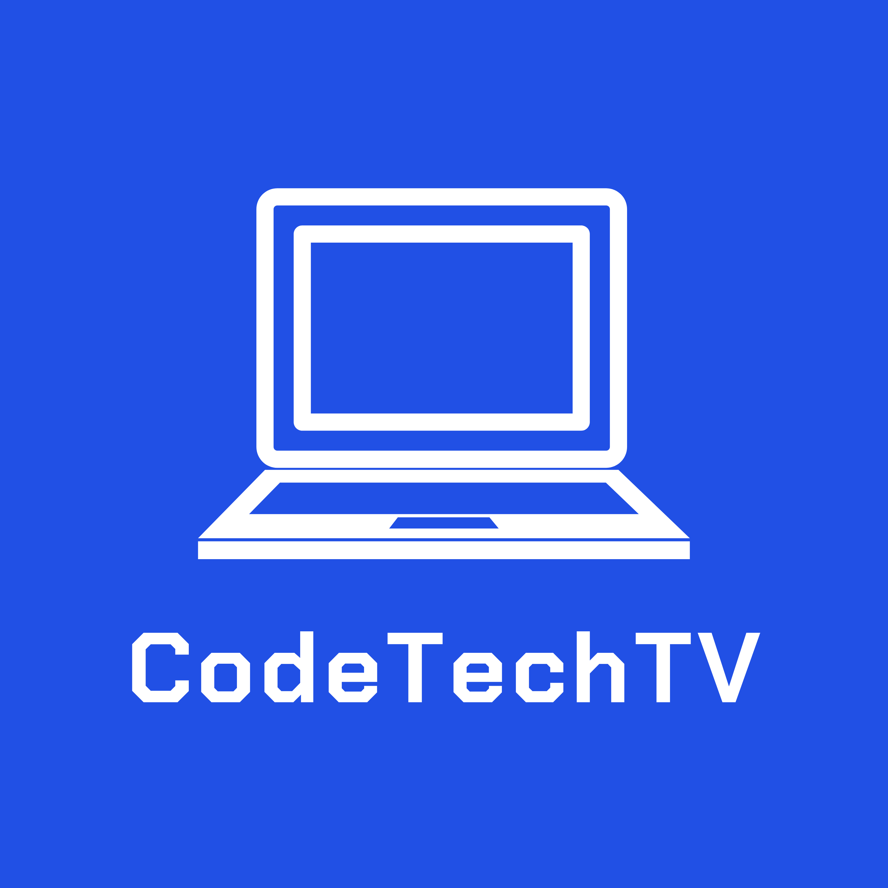

<!-- PROJECT LOGO -->

  

  <h3 align="center">CodeTech TV</h3>

  

    A next.js built react web application. Using the YouTube API and a video player, this app presents the user with free coding videos and tutorials.
  

<!-- TABLE OF CONTENTS -->

  
Table of Contents

  <ol>
    <li>
      <a href="#about-the-project">About The Project</a>
      <ul>
        <li><a href="#built-with">Built With</a></li>
      </ul>
    </li>
    <li>
      <a href="#getting-started">Getting Started</a>
      <ul>
        <li><a href="#prerequisites">Prerequisites</a></li>
        <li><a href="#installation">Installation</a></li>
      </ul>
    </li>
    <li><a href="#usage">Usage</a></li>
    <li><a href="#roadmap">Roadmap</a></li>
    <li><a href="#contributing">Contributing</a></li>
    <li><a href="#license">License</a></li>
    <li><a href="#contact">Contact</a></li>
    <li><a href="#acknowledgements">Acknowledgements</a></li>
  </ol>

<!-- ABOUT THE PROJECT -->

## About The Project

A Next.js and MongoDB built react web application. Featuring the YouTube API and a video player, codetech tv provides the user with free coding tutorials. Users can sign in with Google oauth and next-auth.

### Built With

- [Next.js](https://nextjs.org/)
- [Material-UI](https://material-ui.com/)

<!-- ROADMAP -->

## Roadmap

Keep making vieos into the future.

<!-- CONTRIBUTING -->

## Contributing

Contributions are what make the open source community such an amazing place to be learn, inspire, and create. Any contributions you make are **greatly appreciated**.

1. Fork the Project
2. Create your Feature Branch (`git checkout -b feature/AmazingFeature`)
3. Commit your Changes (`git commit -m 'Add some AmazingFeature'`)
4. Push to the Branch (`git push origin feature/AmazingFeature`)
5. Open a Pull Request

<!-- LICENSE -->

## License

Distributed under the MIT License. See `LICENSE` for more information.

<!-- CONTACT -->

## Contact

Twitter - [@codetechtv](https://twitter.com/codetechtv)

Project Link: [https://github.com/jeffhogg86/codetechtv](https://github.com/jeffhogg86/codetechtv)

Deployment: [https://codetechtv.com](https://codetechtv.com)
